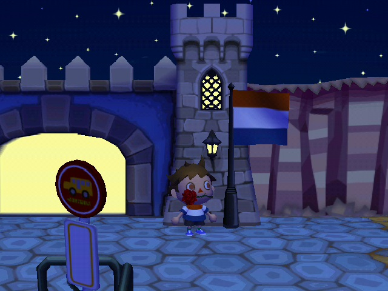
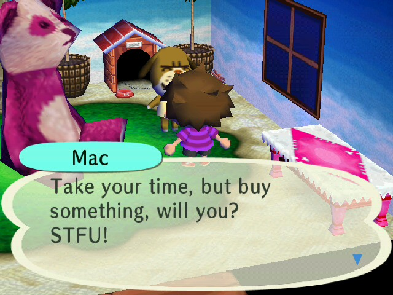

Although this isn't my first Animal Crossing game (that would be New Leaf), this is the first game in the series that I truly got invested into and spent tons of hours in. I fell in love with the atmosphere, music, and even the villagers, while they are a bit more bland in this game compared to earlier entries in the series.

## Welcome to Spinkaas

## Online Multiplayer

Although the Nintendo Wi-Fi Connection (WFC) service shut down in 2014, you can still play this game online! There are pretty large communities on Discord and Reddit that still actively play this game using [Wiimmfi](https://wiimmfi.de/), a free replacement service for the WFC. Here's my friend code if you ever want to play: `1638-1064-3497`.
